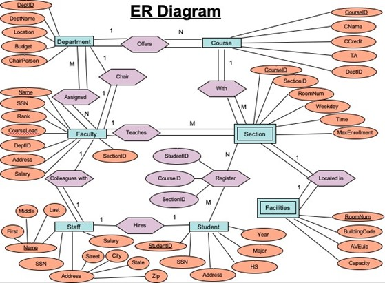
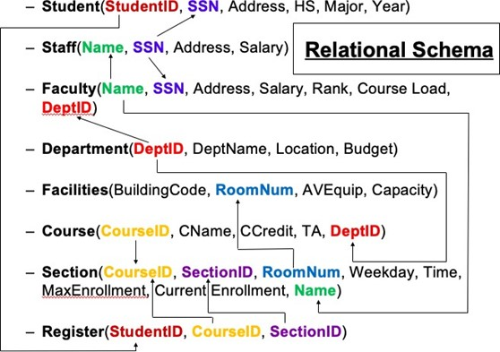
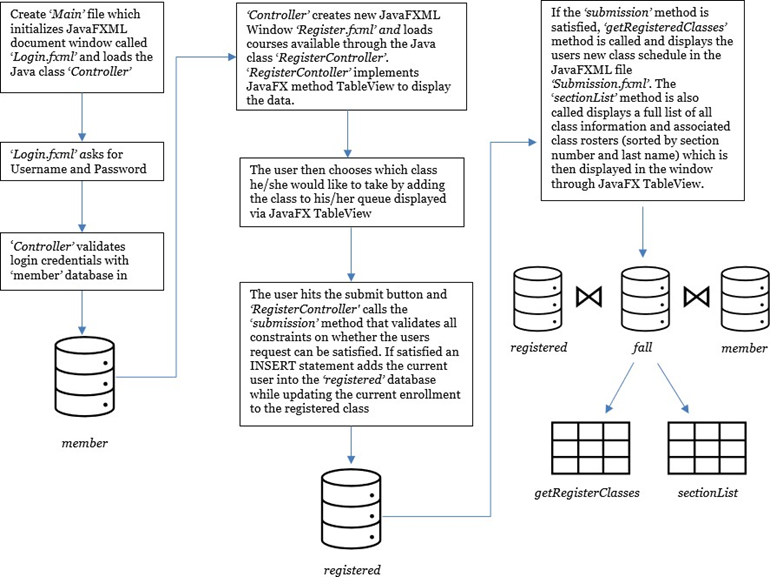

# Student Class Registration

## Introduction

New College is a new college in Newark and is in need of a New College Application Interface Program that will consist of existing databases. Our program was written using JavaFX and SQL. The program interface will consist of the following:

## System Requirements

- Java 8 or higher
- Java IDE (specifically for Java Web Development)
- MySQL

Additions made are as followed:

- JavaFX SDK version 11 or higher
  - JavaFX jar files
  - Scenebuilder
- MySQL-Connector-Java-8 jar file .

## 

## The Relational/Logical Database Design

Our program database is broken down into the following tables: Student, Staff, Faculty, Department, Facilities, Course, Section, and Register. These tables were created in response to what New College required for an application program interface.

Each table had appropriate columns added to store information. The Register table (with the StudentID, CourseID, and Section ID columns) was created in order to
insert/delete/edit/reference between the Student, Course, and Section tables.

## Application Design Process

Our program interface was broken down into two key components (that was also broken down between our personal programming goals towards this project): A user-friendly GUI program and logistical query/programming with JavaFX and SQL.

### 1. GUI Design

- a. Login screen
  - i. Username _aka_ _StudentID_
    1. Primary Key
  - ii. Password
- b. Student Access screen
  - i. Selection options
    1. Course & Time
    2. Section
  - ii. Program determines if space is available within selected course and section
  - iii. Students are limited to one course per year, per semester
  - iv. Each course is limited to a maximum capacity of student enrollment.
- c. Faculty Access screen
  - i. Course list will generate the following:
    1. Course Code
    2. Section Code
    3. Time
    4. Place
    5. Weekday
    6. Instructor
    7. List of Students (alphabetically) by:
       - a. Student ID
       - b. Last Name
       - c. First Name
       - d. Major
       - e. Year

### 2. JavaFX/SQL

- a. **Application Development Requirement 2.1**: Student Registration
- b. **Application Development Requirement 2.2**: Class List Generation

---

## 

## Major Design Decisions

We collectively decided to use the programming language JavaFX to incorporate the information stored in the SQL databases. The JavaFX language will not only allow us to access/edit the SQL database information, but this programming language will also allow us to create a user-friendly GUI program to do so.

## Design Difficulties

1. **JavaFX**
   - a. Creating an ObservableList method of a ‘user’ Object, which executes a SQL statement and returns a list. Furthermore taking that ObservableList and setting cell values in JavaFX TableView.
2. **JDBC-MySQL Connectivity**
   - a. In order to facilitate a connection between JavaFX and a SQL database, a JDBC driver needed to be installed on our device.

## Assumptions

1. **Assumed Attributes**
   - a. The Weekday attribute of Section will have letters associated with the specific day of the week:
     - i. M - Monday
     - ii. T - Tuesday
     - iii. W - Wednesday
     - iv. TH - Thursday
     - v. F - Friday
   - b. The Address attribute of Student, Staff, and Faculty will include Street, City, State, and Zip Code.
   - c. The RoomNum attribute for Section will be taken from the RoomNum attribute from the Facilities table.
2. **Assumed Constraints**
   - a. Teaching Assistants (TA) are considered full-time if they work a maximum of 20 hours a week and they are considered part-time if they work a maximum of 12 hours a week.
   - b. Students may only register for a maximum of 4 courses.
   - c. Every section is taught by one faculty member.
   - d. Faculty members can teach multiple sections of a course or sections of a different course.

## Appendix

Based on the analysis and observation of the specifications mentioned within the report, the following are used:

1. **Entities**
   - a. Student
   - b. Staff
   - c. Faculty
   - d. Department
   - e. Facilities
   - f. Course
   - g. Section
   - h. Register
2. **Relationship Types**
   - a. Assigned (Department → Faculty)
   - b. Colleagues with (Faculty → Staff)
   - c. Offers (Department → Course)
   - d. Teaches (Faculty → Section)
   - e. Register (Student → Course)
   - f. With (Course → Section)
   - g. Hires (Staff → Student)
   - h. Located in (Section → Facilities)
3. **Attributes/Instances**
   - a. Student
     - i. StudentID (Key Attribute)
     - ii. SSN
     - iii. Address
     - iv. High School
     - v. Major
     - vi. Year
   - b. Staff
     - i. Name (Key Attribute)
     - ii. SSN
     - iii. Address
     - iv. Salary
   - c. Faculty
     - i. Name (Key Attribute)
     - ii. SSN
     - iii. Address
     - iv. Salary
     - v. Rank
     - vi. Course Load
     - vii. DeptID
   - d. Department
     - i. DeptID (Key Attribute)
     - ii. DeptName
     - iii. Location
     - iv. Budget
   - e. Facilities
     - i. BuildingCode (Key
     - ii. RoomNum (Key Attribute)
     - iii. AVEquip
     - iv. Capacity
   - f. Course
     - i. CourseID (Key Attribute)
     - ii. CourseName
     - iii. CourseCredit
     - iv. TA
     - v. DeptID
   - g. Section
     - i. CourseID (Key Attribute)
     - ii. SectionID
     - iii. RoomNum
     - iv. Weekday
     - v. Time
     - vi. MaxEnrollment
     - vii. CurrentEnrollment
     - viii. Name (Faculty Instructor Name)
   - h. Register
     - i . StudentID
     - ii. CourseID
     - iii. SectionID
